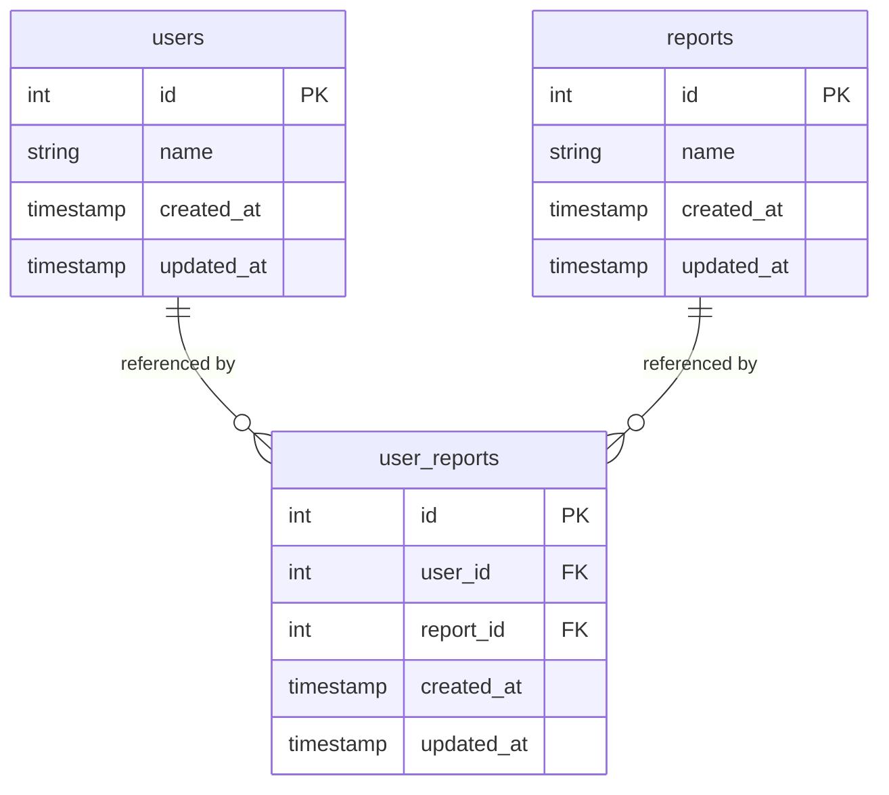

# Usage, CLI, Rake Tasks & Testing

This page covers everything needed to *run* and *test* ddg, as opposed to how its engine works
internally (see [core-concepts.md](/openwiki/core-concepts.md)).

## Configuration: environment variables

ddg has no config file; connection info is passed either as constructor/CLI arguments or read from
environment variables, conventionally via [rbenv-vars](https://github.com/rbenv/rbenv-vars). The
repo root includes `dot-rbenv-vars` as a **non-secret sample** showing the expected variable names
(copy it to `.rbenv-vars` locally and fill in real values — it is gitignored):

| Variable | Used for |
|---|---|
| `ADAPTER`, `HOST`, `PORT`, `USER`, `PASSWORD`, `DATABASE` | Connection info consumed by the CLI (`bin/ddg.rb`) and the `ddg:evaluation_order` Rake task |
| `TEST_HOST`, `TEST_PORT`, `TEST_USER`, `TEST_PASSWORD`, `TEST_DATABASE` | Connection info for the ephemeral test database used by the spec suite and `db:setup:*`/`db:teardown:*` Rake tasks |

## CLI (`bin/ddg.rb`)

The `ddg` executable (declared via `spec.executables` in `ddg.gemspec`, sourced from
`bin/ddg.rb`) wraps `DDG::DependencyGraph` with Ruby's `OptionParser`:

| Flag | Meaning |
|---|---|
| `-a`, `--adapter ADAPTER` | `postgresql`, `mysql`, or `redshift` |
| `-u`, `--user USER` | DB user |
| `-W`, `--password PASSWORD` | DB password |
| `-p`, `--port PORT` | DB port |
| `-h`, `--host HOST` | DB host |
| `-d`, `--database DATABASE` | DB name |
| `-e`, `--evaluation-order` | Print the evaluation order |
| `-v`, `--visualize FORMAT,FILENAME` | Write `<filename>.<format>` (e.g. `graph,png`) |

Example:
```sh
$ ddg -a postgresql -d mydb -u me -W secret -p 5432 -h localhost --evaluation-order
```

Note the CLI's `parse!` method currently **overwrites** any `-a/-u/-W/-p/-h/-d` flags with the
`ADAPTER`/`USER`/`PASSWORD`/`PORT`/`HOST`/`DATABASE` environment variables right after parsing
(see the `TODO` comment in `bin/ddg.rb`) — so in practice, connection info must come from the
environment even when using CLI flags. Keep this in mind before changing CLI behavior.

## Rake tasks (`Rakefile`)

- **Default task** (`rake` / `bundle exec rake`): runs `spec` then `rubocop`. This is what the
  `hooks/pre-commit` git hook runs, and what `.travis.yml` presumably runs in CI.
- **`ddg:evaluation_order`**: builds a `DependencyGraph` from `ADAPTER`/`HOST`/`PORT`/`DATABASE`/
  `USER`/`PASSWORD` env vars and prints `evaluation_order`. This is the Rake equivalent of the
  CLI's `--evaluation-order` flag.
- **`db:setup:postgresql`** / **`db:setup:mysql`**: create a throwaway test database using
  `TEST_*` env vars and load the corresponding schema from `db/schemata/{postgresql,mysql}.sql`.
- **`db:teardown:postgresql`** / **`db:teardown:mysql`**: drop the `user_reports`/`users`/`reports`
  tables (and the test database/user for Postgres) created by the matching `db:setup:*` task.

These `db:setup:*`/`db:teardown:*` tasks are called directly from spec `before(:all)`/`after(:all)`
and per-example `before`/`after` hooks (see below) — they are the test fixture provisioning
mechanism, not a general migration tool.

## Test fixture schema

`db/schemata/postgresql.sql` and `db/schemata/mysql.sql` each define the same three tables, used as
the ground-truth fixture for both the adapter specs and the `DependencyGraph` spec:


*Fixture schema shared by both database backends: `user_reports` has foreign keys into `users` and `reports`.*

This directly explains the expected evaluation order asserted in
`spec/ddg/dependency_graph_spec.rb`: `user_reports` must load after both `users` and `reports`
(`[:users, :reports, :user_reports]` for Postgres, `[:reports, :users, :user_reports]` for MySQL —
tables with no FK dependency on each other can appear in either relative order, since the adapters'
`information_schema` result-row ordering differs between drivers).

## Spec suite (`spec/`)

Structure mirrors `lib/ddg/`:

- `spec/spec_helper.rb` — loads SimpleCov, `bundler/setup`, and `ddg`; disables RSpec monkey-patching.
- `spec/ddg_spec.rb` — sanity check that `DDG::VERSION` is set (`lib/ddg/version.rb`).
- `spec/ddg/adapter_factory_spec.rb` — asserts `AdapterFactory.adapter` returns the right adapter
  class for `:postgresql`, `:redshift`, and `:mysql`, provisioning/tearing down the relevant test DB
  around each example.
- `spec/ddg/adapter/postgresql_spec.rb`, `mysql_spec.rb` — assert `tables_with_foreign_keys`
  returns the expected `{user_reports: [...]}` mapping against the live fixture schema.
- `spec/ddg/dependency_graph_spec.rb` — provisions **both** test databases once for the whole file
  (`before(:all)`/`after(:all)`), then asserts `#initialize`, `#evaluation_order` (per adapter), and
  `#build_graph` behavior. The `#visualize` and the cyclic-graph context are present but currently
  empty (no assertions) — see the note in
  [core-concepts.md](/openwiki/core-concepts.md#ddgdependencygraph) about the untested cycle case.

**Running tests requires live PostgreSQL and MySQL instances** reachable via the `TEST_*` env vars;
there is no mocking/stubbing of the database layer. `SimpleCov` produces a coverage report as a
side effect of running specs.

Run everything with:
```sh
$ bundle exec rake        # spec + rubocop (the default task)
$ bundle exec rspec       # spec only
$ bundle exec rubocop     # lint only
```

## CI, lint, and git hooks

- **`.travis.yml`** configures Travis CI as a Ruby project (build presumably runs the default Rake
  task; Travis is otherwise unconfigured here beyond `language: ruby`).
- **`.rubocop.yml`** excludes `*.gemspec`, `Rakefile`, `bin/ddg.rb`, and `spec/**` from linting, and
  disables `Style/Documentation` (no top-level class-comment requirement) and `Metrics/BlockLength`
  for specs.
- **`hooks/pre-commit`** runs `bundle exec rake` (spec + rubocop) before each commit. Per the
  README, contributors should copy `hooks/` into their local `.git/hooks/` to enable this — it is
  not installed automatically by Bundler/Rake.

## Relationship to the core engine

Every spec here exists to validate the behavior documented in
[core-concepts.md](/openwiki/core-concepts.md): the adapter specs validate the
`information_schema`-based FK query in `Adapter::Base`, and the `DependencyGraph` spec validates
the build/topsort/evaluation-order pipeline against the fixture schema described above.
